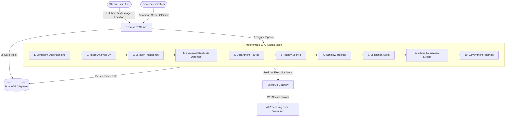

# CivicSwarm Architecture & Multi-Agent Design Document

## 📐 System Architecture Diagram

---

## 🔁 Sequence Flow of Complaint Triage

1. **Submission Phase**: Citizen posts multi-modal payload (Text, Image, Audio, Coordinates).
2. **Persistence Phase**: Ticket initialized with `Reported` status and unique ID (`CIV-XXXXXX`).
3. **Agent Orchestration Phase**:
   - `Agent 1` parses issue type & severity.
   - `Agent 2` runs computer vision hazard detection.
   - `Agent 3` converts coordinates to municipal ward & GeoJSON point.
   - `Agent 4` queries MongoDB `$near` index (500m radius) to merge duplicate citations.
   - `Agent 5` assigns department (PWD / BWSSB / BESCOM / BBMP).
   - `Agent 6` computes 0-100 priority score matrix.
   - `Agent 7` assigns SLA hours and initial timeline.
   - `Agent 8` checks SLA breaches & triggers alerts.
   - `Agent 9` dispatches step updates over WebSocket.
   - `Agent 10` updates government leaderboard.
4. **Dashboard View Phase**: Government officers inspect ticket on interactive Leaflet GIS map with priority pulse colors.
